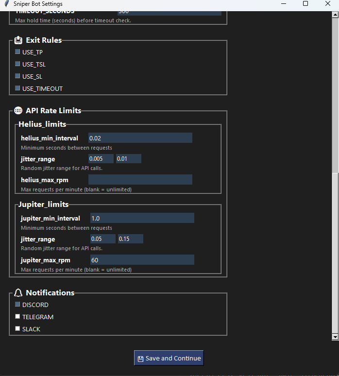

# Automated Solana Sniper Bot

    
  

## Overview  

**Automated Solana Sniper Bot (v3.4.3)** is a modular, database-backed system for real-time token detection (Helius), automated trading (Jupiter), and position management (with live tracking, exit rules, and UI dashboard).  

The system has evolved from CSV-based simulation to full **SQL persistence**, enabling advanced analytics, smoother UI integration, and fault-tolerant trade recovery.

---

## Features

- **Real-time token detection**
  - Helius WebSocket stream + transaction parsing.
  - Token age & liquidity filters to catch only fresh, tradeable tokens.

- **Automated trading (SIM or REAL)**
  - Buys/sells via Jupiter.
  - `SIM_MODE` for safe, realistic testing (real quotes, no on-chain swaps).
  - Real mode with optional **Helius Sender** for low-latency inclusion.

- **Exit rules**
  - Take Profit (TP)
  - Stop Loss (SL)
  - Trailing Stop Loss (TSL)
  - Timeout-based exits
  - All controlled via `config/bot_settings.json`.

- **Strategy & safety tools**
  - Liquidity analyzer with per-token snapshots.
  - Volume tracking around launch.
  - Rug/safety scoring (LP, holders, volume, marketcap).

- **Database-backed**
  - PostgreSQL schema for:
    - `tokens`, `trades`, `signatures`
    - `liquidity_snapshots`, `token_volumes`
    - `token_stats`, `safety_results`, `token_pools`
  - Makes recovery, analytics, and dashboards much easier.

- **Wallet hygiene**
  - `clean_dust_tokens()` burns tiny token balances and closes token accounts to reclaim rent.

- **Multiple run modes**
  - **UI mode** – Tkinter dashboard (`SniperBotUI`) with live table view and controls.
  - **CLI mode** – terminal-only, interactive.
  - **Server mode** – headless (`--server`), ideal for VPS/Docker.

---

## Screenshots

### UI Dashboard (Live Trading View)  
  

Shows bot status, wallet balance, API usage, trade settings, and real-time closed positions with PnL tracking.  

### UI Settings  
    

Configuration panel for setting TP, SL, TSL, timeout, and enabling/disabling exit rules.  

### UI POPUP


Modern fixed-size popup displaying full trade details for any position.

---

## Installation  

```bash
git clone https://github.com/AintSmurf/Automated-Solana-Sniper-Bot/.git
cd Automated-Solana-Sniper-Bot/
python -m venv venv
source venv/bin/activate   # On Linux/macOS
venv\Scripts\activate      # On Windows
python -m pip install --upgrade pip setuptools wheel
pip install .
python .\bot_scripts\db_initializer.py  #DB creation
```
## Running the Bot

The bot can be launched in three main modes: UI, CLI, and Server.

On the first run, it will also prompt you to choose your preferred mode and configure settings.

---


### First Run (No bot_settings.json yet)

```bash
python main.py 
```

- When you run the bot for the first time:
  ```
  First run detected — launch with graphical UI? (y/N):
  ```
  - If you choose yes → the tkinter UI will open
  - If you choose no → the bot runs in CLI mode and will also prompt you for initial settings (e.g., liquidity, trade amount, thresholds)
  - Your answers will be saved to bot_settings.json (unless you pass --no-save)
---
### UI Mode (Graphical Interface)

```bash
python main.py --ui
```

- Forces the bot to run in the terminal only, ignoring UI settings
- Useful for configuration and live monitoring
- **Recommended** for beginners or for manual supervision of the bot

---

### CLI Mode (Interactive Terminal)

```bash
python main.py --cli
```

- Forces the bot to run in the terminal only, ignoring UI settings
- Displays logs, buys, and sells in real time
- Sends alerts to Discord (if configured)
---

### Server Mode (Headless / No Prompts)

```bash
python main.py --s or python main.py --server 
```

- Runs in headless CLI mode with zero prompts, even on first run
- Uses whatever is saved in bot_settings.json
- Ideal for **cloud servers, VPS, or Docker containers**
- Auto-shutdown kicks in after `MAXIMUM_TRADES` is reached:
  - The bot stops opening new trades,
  - Waits for all pending signatures + open positions to fully resolve,
  - Then performs a clean shutdown.
- If bot_settings.json does not exist, a new one will be created using default settings

---

### Temporary Overrides (Without Saving)

```bash
python main.py --ui --no-save
```

- Launches in UI mode just for this run, but does not overwrite the saved UI_MODE in bot_settings.json
- Works with --ui, --cli

---

## Further Documentation

For full configuration, deployment, and analysis details, see:

- [Architecture & Internals](docs/ARCHITECTURE.md)
- [Config Files Overview](docs/CONFIGURATION.md)
- [Logs & Analysis](docs/LOGS_AND_ANALYSIS.md)
- [Deployment (Docker + Ansible)](docs/DEPLOYMENT_ANSIBLE.md)
- [roadmap](docs/ROADMAP.md)
- [Changelog](CHANGELOG.md)


---

## Disclaimer

This project is intended for **educational and research purposes only**. Automated trading involves financial risk. You are solely responsible for how you use this software. No guarantees are made regarding financial return or token accuracy.

---

## License

This project is licensed under the [MIT License](LICENSE).

