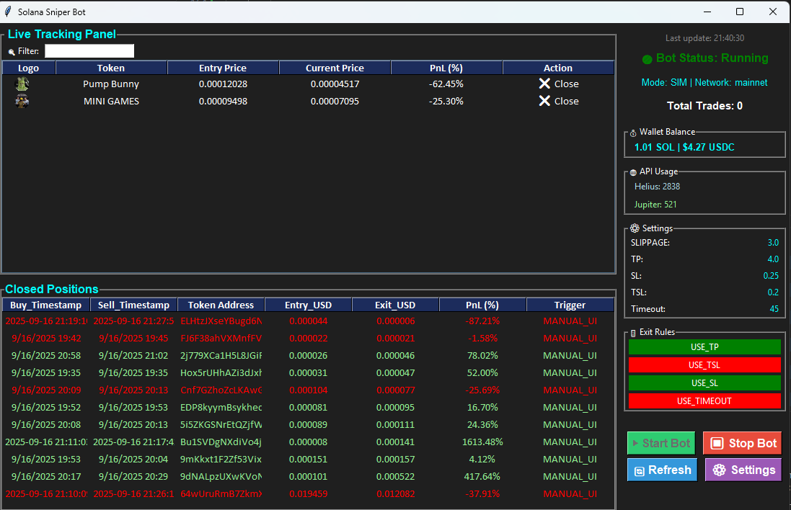
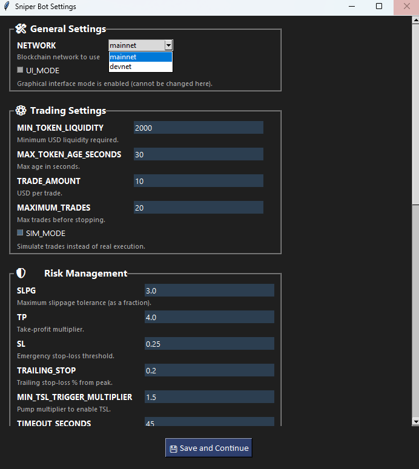

# Automated Solana Sniper Bot

    
  

## Overview  

**Automated Solana Sniper Bot (v3.4.0)** is a modular, database-backed system for real-time token detection (Helius), automated trading (Jupiter), and position management (with live tracking, exit rules, and UI dashboard).  

The system has evolved from CSV-based simulation to full **SQL persistence**, enabling advanced analytics, smoother UI integration, and fault-tolerant trade recovery.

### Architecture Highlights
- **Detection layer** — Helius WebSocket stream + transaction analysis  
- **Execution layer** — Jupiter-powered trading via `TraderManager`  
- **Persistence layer** — PostgreSQL via `SqlDBUtility`, `TradeDAO`, `SignatureDAO`, `TokenDAO`  
- **Tracking layer** — DB-aware `OpenPositionTracker` with exit rules (TP / SL / TSL / Timeout)  
- **UI layer** — Tkinter-based dashboard (`SniperBotUI`) with live table view and manual controls  
- **Orchestration** — `BotOrchestrator` wires all services, manages async tasks and shutdown  

---

## Table of Contents  

- [Screenshots](#screenshots)  
- [New in 3.4.0](#new-in-340)
- [Prerequisites](#prerequisites)  
- [Features](#features)  
- [Requirements](#requirements)  
- [Config Files Overview](#config-files-overview)  
- [Installation](#installation)  
- [Running the Bot](#running-the-bot)  
- [Configuration](#configuration)
- [Roadmap](#roadmap)  
- [Log Management](#log-management)  
- [Log Summarization Tool](#log-summarization-tool)  
- [Disclaimer](#disclaimer)  
- [License](#license)  

---
## Important Notes

- Make sure `bot_settings.json` is properly configured before using `--server` mode.
- Your private key and API keys are loaded from environment variables or `.env`/JSON securely.
- All trades in **simulation** unless you explicitly disable `SIM_MODE` in the settings.
- SIM_MODE still connects to mainnet and fetches real Jupiter quotes, so price and output values are accurate
  - Difference: it does not broadcast a transaction or spend SOL.
  - Instead, it logs a SIMULATED_BUY to CSV with calculated entry price and tokens received.
  - slippage and mevbot not included so pnl will be abit off
- Use mainnet only when ready for real trading; devnet is for testing only
- Post-buy Tracking implemented  but not integrated yet under testing
- In **real trading mode**, the bot can optionally route buy transactions through **Helius Sender** for faster inclusion. This path:
  - Requests a legacy Jupiter swap transaction (`asLegacyTransaction = True`),
  - Prepends a Jito-tipped Helius tip instruction,
  - Re-signs the transaction and sends it via the Sender HTTP endpoint.


## Screenshots  

### UI Dashboard (Live Trading View)  
  

Shows bot status, wallet balance, API usage, trade settings, and real-time closed positions with PnL tracking.  

### UI Settings  
    

Configuration panel for setting TP, SL, TSL, timeout, and enabling/disabling exit rules.  

### UI POPUP


Modern fixed-size popup displaying full trade details for any position.

---

## New in 3.4.0

- **Trade lifecycle hardening**
  - New `SELLING` status in the `trades` table:
    - `TraderManager.sell()` marks a trade as `SELLING` before broadcasting the swap.
    - Prevents the reconciliation logic from treating in-flight exits as LOST.
  - `TradeDAO.get_live_trades()` returns only logically “open” trades:
    - `FINALIZED`, `SELLING`, `SIMULATED` (excludes `RECOVERED` / `CLOSED`).
  - `OpenPositionTracker.has_open_positions()`:
    - Checks in-memory `active_trades` for those statuses.
    - Falls back to `get_live_trades()` in the DB.
    - Ignores `RECOVERED` / `CLOSED` rows when deciding if the bot can stop.

- **Safer shutdown after MAXIMUM_TRADES**
  - When `TradeCounter` reaches `MAXIMUM_TRADES`:
    - WebSocket + fetcher stop accepting new trades.
    - The bot **waits** until:
      - There are no pending signature verifications (`TraderManager.pending_futures`),
      - No `FINALIZED` / `SELLING` / `SIMULATED` trades remain in memory,
      - No matching live trades remain in the DB.
    - Only then the orchestrator performs full shutdown.
  - Fixes the edge case where the last BUY was broadcast right before shutdown and ended up finalized after the bot already exited.

- **Reconciliation & dust-aware recovery**
  - `_reconcile_wallet_with_db()` now:
    - Uses `DUST_THRESHOLD_USD` + cached prices to ignore tiny “dust” balances.
    - Skips tokens that are:
      - Already in `active_trades`, or
      - In `SELLING` status.
    - Only:
      - Creates `RECOVERED` trades when a non-dust token exists in the wallet but is missing in DB and not active.
      - Marks as `LOST` when the token is gone from the wallet, not active, and not `SELLING`.
  - Prevents false LOST/RECOVERED events during TP/SL or brief wallet/DB desyncs.


---

## Prerequisites  

You'll need the following before running the bot:  

- A funded Solana wallet  
- A Helius API Key (WebSocket + REST access)  
- A SOLANA_PRIVATE_KEY — wallet key  
- A Discord bot token — for notifications  
- A BirdEye API Key (for liquidity & price fallback) (Optional)   
- **PostgreSQL** database for persistent trade storage

---


## Features  

### Core System
- Real-time token detection via Helius WebSocket  
- Automated Jupiter buy/sell with price simulation or execution  
- Exit rules: TP / SL / TSL / Timeout  
- Full multi-threaded orchestration
- Optional low-latency execution via **Helius Sender** for real trades (Jupiter Swap API → legacy tx → tip ix → Sender HTTP endpoint)  
- Robust trade lifecycle:
  - Explicit `FINALIZED` / `SELLING` / `RECOVERED` / `CLOSED` states.
  - DB–wallet reconciliation that respects in-flight exits and dust thresholds.
  - Safe auto-shutdown once all trades and pending signatures are resolved.


###  Database Persistence

| Table               | Purpose                                                                 |
|---------------------|-------------------------------------------------------------------------|
| `tokens`            | Mint info and metadata (token_address, first detection signature, time) |
| `trades`            | Each position: BUY/SELL, entry/exit USD, PnL%, trigger_reason, status, simulation flag, timestamps |
| `signatures`        | Buy/sell signature mapping per token + buy/sell times                  |
| `token_stats`       | Market data snapshot: market cap, holder count per token               |
| `safety_results`    | Rug/safety checks: LP, holders, volume, marketcap flags + score        |
| `token_volumes`     | Aggregated volume stats: buy/sell USD, counts, net flow, launch volume |
| `liquidity_snapshots` | Time-series liquidity (SOL/USDC/USDT/USD1 + total) per token         |
| `token_pools`       | Pool mapping: pool address, DEX source, created_at                     |

### Strategy Tools
- Liquidity analyzer with on-chain pricing  
- Volume tracker with launch snapshot  
- Scam detection and token audit 

### Wallet Hygiene

- **Dust Cleaner (manual)**  
  - `clean_dust_tokens(dust_threshold_usd=1.0)` scans your SPL balances.  
  - Uses Jupiter to estimate per-token USD value.  
  - For tiny positions below the threshold:
    - Builds a `burn` ix for the full raw amount.
    - Builds a `close_account` ix to reclaim rent.
    - Signs and sends a compact `MessageV0` transaction via Helius.  
  - Logs each cleaned mint and its transaction signature.


### 🔔 Notifications
- Discord alerts (live detection / safe tokens)  
- Telegram & Slack support (planned)

---

## Requirements  

- Python 3.8+  
- Key packages:  
  `solana`, `solders`, `pandas`, `requests`, `websocket-client`  

---

## Config Files Overview  


| File | Purpose |  
|------|---------|  
| `config/bot_settings.py` | Core parameters (TP/SL, liquidity threshold, SIM mode, rate limits) |  
| `config/dex_detection_rules.py` | Per-DEX rules for token validation |  
| `config/blacklist.py` | Known scam or blocked token addresses |  
| `config/network.py` | Solana network constants and RPC endpoint mapping |  
| `config/third_parties.py` | Third-party endpoints (Jupiter, BirdEye, dexscreener) |  
| `services/bot_context.py` | Central context manager (API keys, settings, shared state) |  
| `credentials.sh` / `.ps1` / `.sh` | Stores API keys and private key exports (Helius,  Discord token, SOL private key, BirdEye).|


---
### Credentials & Secrets

The bot requires several private credentials (Helius API key, SOL private key, Discord bot token, optional BirdEye key). These should be provided via environment variables, a local `credentials.sh`/PowerShell script, or a `.sh` file.
```bash
export HELIUS_API_KEY=''
export SOLANA_PRIVATE_KEY=''
export DISCORD_TOKEN=''
export BIRD_EYE=''
export DEX=''
export DB_NAME=""
export DB_HOST=""
export DB_PORT=
export DB_USER=""
export DB_PASSWORD=""
```


## Installation  

```bash
git clone https://github.com/AintSmurf/Automated-Solana-Sniper-Bot/.git
cd Automated-Solana-Sniper-Bot/
python -m venv venv
source venv/bin/activate   # On Linux/macOS
venv\Scripts\activate      # On Windows
python -m pip install --upgrade pip setuptools wheel
pip install .
python .\bot_scripts\db_initializer.py  #DB creation
```
## Running the Bot

The bot can be launched in three main modes: UI, CLI, and Server.

On the first run, it will also prompt you to choose your preferred mode and configure settings.

---


### First Run (No bot_settings.json yet)

```bash
python main.py 
```

- When you run the bot for the first time:
  ```
  First run detected — launch with graphical UI? (y/N):
  ```
  - If you choose yes → the tkinter UI will open
  - If you choose no → the bot runs in CLI mode and will also prompt you for initial settings (e.g., liquidity, trade amount, thresholds)
  - Your answers will be saved to bot_settings.json (unless you pass --no-save)
---
### UI Mode (Graphical Interface)

```bash
python main.py --ui
```

- Forces the bot to run in the terminal only, ignoring UI settings
- Useful for configuration and live monitoring
- **Recommended** for beginners or for manual supervision of the bot

---

### CLI Mode (Interactive Terminal)

```bash
python main.py --cli
```

- Forces the bot to run in the terminal only, ignoring UI settings
- Displays logs, buys, and sells in real time
- Sends alerts to Discord (if configured)
---

### Server Mode (Headless / No Prompts)

```bash
python main.py --s or python main.py --server 
```

- Runs in headless CLI mode with zero prompts, even on first run
- Uses whatever is saved in bot_settings.json
- Ideal for **cloud servers, VPS, or Docker containers**
- Auto-shutdown kicks in after `MAXIMUM_TRADES` is reached:
  - The bot stops opening new trades,
  - Waits for all pending signatures + open positions to fully resolve,
  - Then performs a clean shutdown.
- If bot_settings.json does not exist, a new one will be created using default settings

---

### Temporary Overrides (Without Saving)

```bash
python main.py --ui --no-save
```

- Launches in UI mode just for this run, but does not overwrite the saved UI_MODE in bot_settings.json
- Works with --ui, --cli

---

## Configuration

```python
{
    #Solana blockchain mainnet- real, devnet-development/test network
    "NETWORK":"mainnet"
    
    # Whether to run the bot with a UI (tkinter dashboard)
    "UI_MODE": False,

    # Minimum liquidity required (USD) to consider a token worth trading
    "MIN_TOKEN_LIQUIDITY": 10000,

    # Maximum token age (in seconds) to be considered "fresh"
    "MAX_TOKEN_AGE_SECONDS": 30,

    # Amount (in USD) per trade (simulation or real)
    "TRADE_AMOUNT": 10,

    # Max number of trades before the bot shuts down
    "MAXIMUM_TRADES": 20,

    # True = simulation mode, False = real trading
    "SIM_MODE": True,

    # Timeout conditions
    "TIMEOUT_SECONDS": 180,           # After 180s, check if profit threshold met
    "TIMEOUT_PROFIT_THRESHOLD": 1.03, # If < +3% profit → force exit

    # Take profit and stop loss rules
    "SLPG": 3.0,                      # SLPG is a percent expressed as a float (e.g. 3.0 = 3%). The bot converts SLPG → slippageBps for Jupiter by int(SLPG * 100) (so 3.0 → 300 bps).
    "TP": 4.0,                        # +300% (4x entry)
    "SL": 0.25,                       # 25% drop from entry
    "TRAILING_STOP": 0.2,             # 20% below peak price
    "MIN_TSL_TRIGGER_MULTIPLIER": 1.5,# TSL only kicks in after 1.5x

    # tokens under this USD value are eligible for dust cleanup
    "DUST_THRESHOLD_USD":1,

    # Ultra-low-latency Solana transaction submission via Helius Sender,
    # optimized for high-frequency / competitive trading.
    "USE_SENDER": {
        # Choose the region closest to your server for better landing speed.
        # Available options are listed in config/network.py.
        # maps to HELIUS_SENDER[...] in config/network.py
        "REGION": "global",

        # If True: use Helius Sender path for buy transactions.
        # Requires enough SOL for both the swap and the Jito/Helius tip.
        "BUY": False,

        # If True: use Helius Sender path for sell transactions.
        # Requires enough SOL for both the swap and the Jito/Helius tip.
        "SELL": False,
    },  


    # Exit rule toggles
    "EXIT_RULES": {
        "USE_TP": False,
        "USE_TSL": False,
        "USE_SL": False,
        "USE_TIMEOUT": False
    },

    # Notification channels
    "NOTIFY": {
        "DISCORD": False,
        "TELEGRAM": False,
        "SLACK": False,
    },

    # API rate limits
    "RATE_LIMITS": {
        "helius": {
            "min_interval": 0.02,             # seconds between requests
            "jitter_range": [0.005, 0.01],    # randomness to avoid bursts
            "max_requests_per_minute": None,  # unlimited
            "name": "Helius_limits"
        },
        "jupiter": {
            "min_interval": 1.1,              # seconds between requests
            "jitter_range": [0.05, 0.15],     # randomness to avoid bursts
            "max_requests_per_minute": 60,    # requests per minute
            "name": "Jupiter_limits"
        }
    }
}

```

##  Docker Setup 
- You can run the bot inside Docker using the provided **Dockerfile.bot**
  - Configure credentials in Credentials.sh (or use environment variables)
  ```env
    HELIUS_API_KEY=your_helius_api_key
    SOLANA_PRIVATE_KEY=your_base58_private_key 
    DISCORD_TOKEN=your_discord_bot_token 
    BIRD_EYE=your_birdeye_key (optional)
    DEX="Pumpfun" or "Raydium"
    DB_NAME="sniper_db"
    DB_HOST="your_postgres_host"
    DB_PORT=5432
    DB_USER="sniper_user"
    DB_PASSWORD="super_secret_password"
    ```
  - Prepare settings
    Since Docker runs the bot with the --s (server) flag, there are no prompts.
    Make sure a valid bot_settings.json is already present in your project under folder config.
      - If bot_settings.json is missing, Docker will create one with default settings.
      - It’s recommended to configure it locally first and then mount it into the container.
  - Build the Docker image
    ```bash
    docker build -f Dockerfile.bot -t solana-sniper-bot .
    ```  
  - Initialize the Database (one-time)
    ```bash
    docker run --rm  solana-sniper-bot bash -lc "source ./Credentials.sh && python -m bot_scripts.db_initializer"
    ```
  - Run the bot inside Docker
    ```bash
    docker run --name solana-sniper-bot solana-sniper-bot
    ```
    The Dockerfile.bot’s default CMD does:
    ```bash
    bash -lc "source ./Credentials.sh && python -u main.py --server"
    ```
    So the bot:

      - loads your credentials from Credentials.sh

      - runs in server mode (headless, no prompts)

      - respects MAXIMUM_TRADES and performs a clean shutdown after all trades are resolved

## Roadmap

- **Backup Price Source (Birdeye / on chain / - fallback, added but not fully integrated)** — Secondary price feeds to ensure reliability when Jupiter or Helius rates fail.  

- **Volume Tracking (beta)** — Tracks USD inflows/outflows per token to identify hype and unusual activity.  
  - Currently saves snapshots but accuracy still needs improvement.  

- **Blacklist / Whitelist automated detection (planned)** — Automatically flags suspicious tokens or prioritizes trusted ones.  
  - Integrated into detection and exit rule checks.    

- **Telegram Notifications (planned)** — Send trade alerts, errors, and detection events to Telegram channels.  

- **Slack Notifications (planned)** — Push alerts and trading activity into Slack workspaces.  

- **Web Dashboard (planned)** — A lightweight web UI for remote monitoring and control.  
  - Real-time feeds: detection events, open positions, closed positions, and logs.  
  - Live charts for PnL and token price history.  
  - Remote controls: start/stop bot, trigger manual sell, adjust trading settings.  

- **Track tokens by address (planned)** — Add tokens to a watchlist by mint address (manual or via detection).  
  - Watchlist supports per-token overrides (custom TP/SL, trade size, whitelist/blacklist).  
  - Watchlist shown in UI and accessible from the web dashboard or CLI.  
- **Automated Tests (pytest)** — unit and integration tests for buy/sell flows, volume tracking, and context initialization.


## Log Management

Logs are organized for clarity and traceability:
| File                             | Description                              |
| -------------------------------- | ---------------------------------------- |
| `logs/info.log`                  | General info/debug logs                  |
| `logs/debug.log`                 | Developer-focused debug logs             |
| `logs/console_logs/console.info` | Simplified console view                  |
| `logs/special_debug.log`         | Critical debug logs (e.g. scam analysis) |

---


## Log Summarization Tool

This tool allows you to extract, clean, and analyze logs for one or multiple token addresses and transaction signatures.

### Functionality

- Searches across:
  - `logs/debug/`
  - `logs/backup/debug/`
  - `logs/info.log`
- Matches logs by:
  - `--signature` (transaction signature)
  - `--token` (mint address)
- Removes duplicate or overlapping lines
- Sorts all matched logs chronologically
- Outputs a clean, consolidated log to:  
  `logs/matched_logs/<token_address>.log`

---

### Manual Usage (One Token)

To analyze a **single** token and transaction:
```bash
    python -m bot_scripts.analyze --signature <txn_signature> --token <token_address>
```
This will:

- Search all configured log locations for that signature and token.
- Deduplicate and time-sort all matches.
- Write the results to: `logs/matched_logs/<token_address>.log`.

---

### Batch Usage (Multiple Tokens via DB)

To analyze multiple tokens in parallel:

```bash
    python -m bot_scripts.run_analyze [options...]
```

Explanation:

- Builds a DB context  
- Queries `tokens` + `trades` via `TokenDAO.fetch_mint_signature(...)`  
- Selects only the relevant tokens (based on filters)  
- Runs `analyze.py` in parallel for each `(signature, token_address)` pair  
- Uses `max_workers=10` by default  

Available Options:

- `--reason {lost,tp,sl,tsl,timeout,manual}`  
  Filter by trades with a given `trigger_reason` / `exit_reason`.  
  Examples: LOST rugs, TP (take-profit), SL (stop-loss), etc.

- `--today`  
  Only include trades from *today*  
  (00:00 → 00:00 in the local machine's timezone).

- `--since YYYY-MM-DD`  
  Only include trades with `timestamp >=` this date (open-ended).  
  Example: `--since 2025-11-01`

- `--all`  
  Ignore trade filters and process **all tokens** from the `tokens` table.

- `--limit N`  
  Process at most **N tokens** (useful for testing / sampling).

Example commands:

    # LOST tokens today
    python -m bot_scripts.run_analyze --reason lost --today

    # TP tokens since 2025-11-01
    python -m bot_scripts.run_analyze --reason tp --since 2025-11-01

    # Any tokens with trades today (any reason)
    python -m bot_scripts.run_analyze --today

    # All tokens, but only first 20
    python -m bot_scripts.run_analyze --all --limit 20

---

## Summary Report Tool

This tool produces an Excel summary of your trades and daily performance.

To generate the summary:

```bash
    python -m bot_scripts.produce_summary
```

Explanation:

- Connects to the DB via `TokenDAO`  
- Pulls:
  - Detailed per-trade data  
  - Aggregated per-session data (07:00 → next-day 07:00, local time)  
- Writes an Excel file:  
  `summary_results.xlsx`

The Excel file currently contains:

### `Summary` – per-trade details

- Columns:  
  `token`, `buy_event`, `sell_event`,  
  `buy_price`, `sell_price`,  
  `profit_percent`, `exit_reason`,  
  `post_buy_score`, `marketcap`
- Numeric columns are formatted (prices, PnL %, marketcap).

### `PerSession` – per “trading day”

- Trading day is defined as: **07:00 → next-day 07:00** (local timezone)
- Columns:
  - `session_date`
  - `trade_count`
  - `total_pnl_percent`
  - `avg_pnl_percent`
  - `winning_trades`
  - `losing_trades`
- Uses the PC’s local timezone offset to define sessions.
- Lets you see:
  - Winning/losing streaks
  - Daily/session performance
  - Rug-heavy days vs. good days


## Disclaimer

This project is intended for **educational and research purposes only**. Automated trading involves financial risk. You are solely responsible for how you use this software. No guarantees are made regarding financial return or token accuracy.

---

## License

This project is licensed under the [MIT License](LICENSE).

