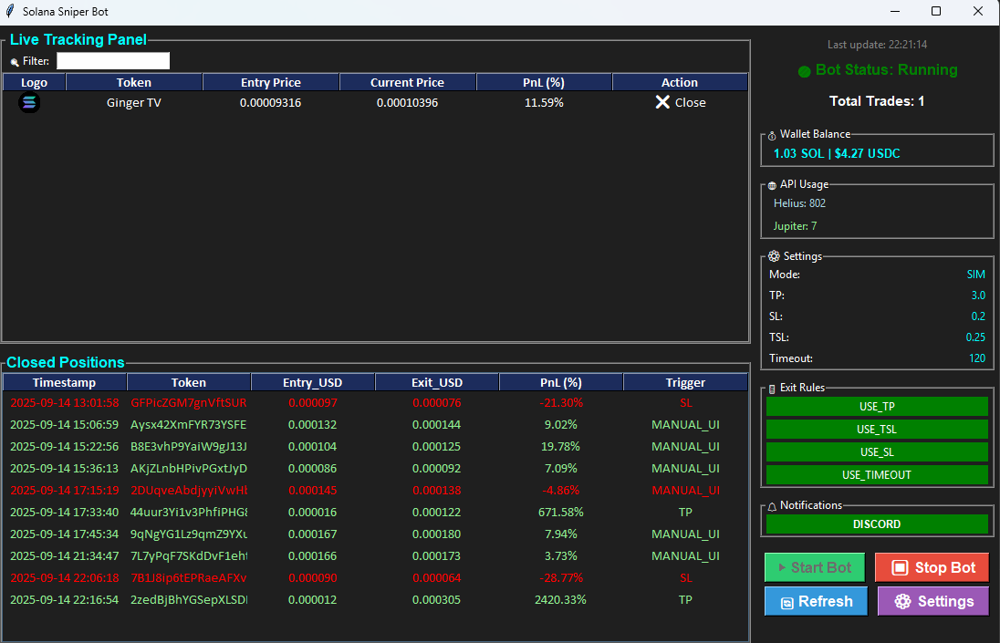
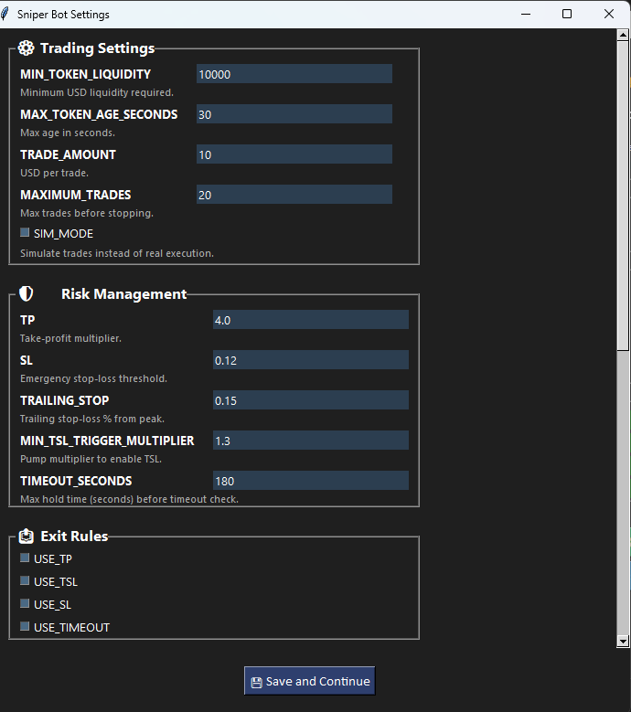
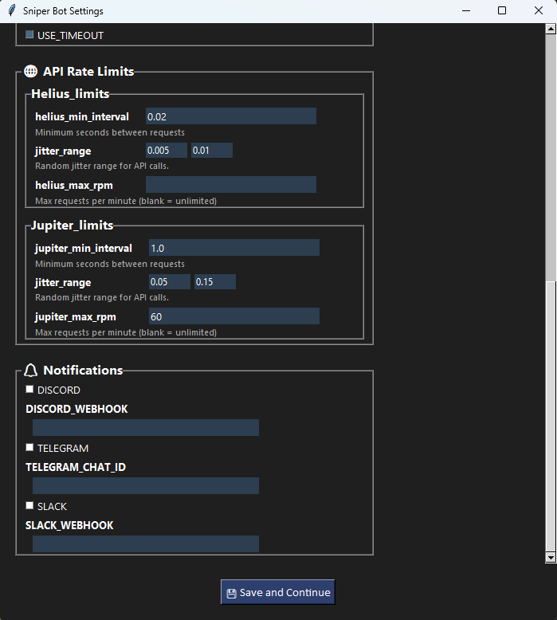
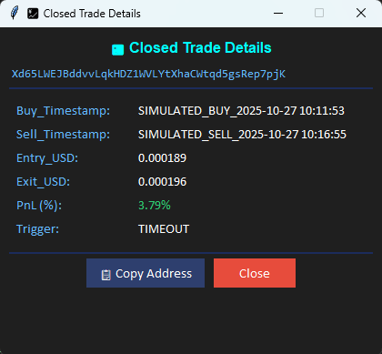

## Screenshots

### UI Dashboard (Live Trading View)  
  

Shows bot status, wallet balance, API usage, trade settings, and real-time closed positions with PnL tracking.  

### UI Settings  
    

Configuration panel for setting TP, SL, TSL, timeout, and enabling/disabling exit rules.  

### UI POPUP

Modern fixed-size popup displaying full trade details for any position.

---
